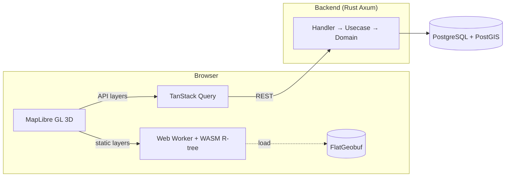

# Terrasight

不動産投資データ可視化プラットフォーム — 土地の見えないリスクと価値を可視化する。

国土交通省 (MLIT) の公示地価・災害リスク・施設データを統合し、24 レイヤーの空間データを 3D マップ上に重畳表示。WASM 空間エンジンによる高速クエリと独自の投資スコア (0-100) で、不動産投資の意思決定を支援する。

## Tech Stack

| Layer | Technology |
|-------|------------|
| Backend | Rust (Axum + Tokio + SQLx + PostGIS) |
| Frontend | Next.js 16 (App Router) + React 19 + MapLibre GL + shadcn/ui + Tailwind CSS v4 |
| WASM | Rust → wasm-bindgen → Web Worker (R-tree spatial queries) |
| Database | PostgreSQL 16 + PostGIS 3.4 |
| Infra | Docker Compose |

## Architecture



```bash
services/
├── backend/    # Rust Axum API (Clean Architecture: handler/usecase/domain/infra)
├── frontend/   # Next.js 16 (features/components/stores/hooks)
└── wasm/       # Rust WASM spatial engine (R-tree, FlatGeobuf)
```

## Data Layers (24)

| Category | Layers | Source |
|----------|--------|--------|
| Price | Land Price (time series), Land Price 3D Extrusion | MLIT L01 / PostGIS |
| Risk | Flood, Flood History, Steep Slope, Liquefaction, Landslide | MLIT A31b/A33/A47 / FGB |
| Geology | Geology, Landform, Soil | MLIT / FGB |
| Seismic | Fault, Volcano, Seismic Intensity | J-SHIS / FGB |
| Infrastructure | Railway, Station, Schools, Medical, DID | MLIT / FGB + PostGIS |
| Admin | Admin Boundary, Zoning, Population Mesh, Boundary | MLIT / FGB + PostGIS |

Static layers are stored as FlatGeobuf (`data/fgb/`) and queried via WASM R-tree. API layers are served from PostGIS.

## API Endpoints

| Method | Path | Description |
|--------|------|-------------|
| GET | `/api/health` | Service health check (DB connectivity, API key status) |
| GET | `/api/area-data` | GeoJSON layers for a bounding box (flood, slope, zoning, facilities) |
| GET | `/api/score` | Investment score (0-100) for a coordinate |
| GET | `/api/stats` | Aggregated statistics for a bounding box |
| GET | `/api/trend` | Price trend / CAGR analysis for a coordinate |

## Getting Started

### Prerequisites

- [Rust](https://rustup.rs/) (stable)
- [Node.js](https://nodejs.org/) 22+ / [pnpm](https://pnpm.io/)
- [Docker](https://docs.docker.com/get-docker/) & Docker Compose
- [uv](https://docs.astral.sh/uv/) (Python data pipeline)
- [lefthook](https://github.com/evilmartians/lefthook) (git hooks)

### Setup

```bash
# 1. Clone and configure
git clone <repo-url> && cd terrasight
cp .env.example .env   # Edit with your API keys

# 2. Start database
docker compose up -d db

# 3. Database setup (migrate + seed + import all data)
./scripts/commands/db-full-reset.sh

# 4. Build static data (GeoJSON → FlatGeobuf)
uv run scripts/tools/build_static_data.py

# 5. Run backend
cd services/backend && cargo run

# 6. Run frontend (separate terminal)
cd services/frontend && pnpm install && pnpm dev
```

### Docker Compose (all services)

```bash
docker compose up -d --build
```

| Service | Port |
|---------|------|
| Frontend | http://localhost:3000 |
| Backend | http://localhost:8000 |
| PostgreSQL | localhost:5432 |

## Environment Variables

| Variable | Required | Description |
|----------|----------|-------------|
| `DB_PASSWORD` | Yes | PostgreSQL password |
| `DATABASE_URL` | Yes | Full connection string (auto-set in Docker) |
| `REINFOLIB_API_KEY` | No | MLIT Reinfolib API key (enables live data) |
| `ESTAT_APP_ID` | No | e-Stat API key |
| `RUST_LOG` | No | Log level filter (default: `info`) |
| `NEXT_PUBLIC_API_URL` | Yes | Backend URL for frontend (default: `http://localhost:8000`) |

## Development

### Build & Test

```bash
# Backend
cd services/backend
cargo build && cargo test && cargo clippy -- -D warnings

# Frontend
cd services/frontend
pnpm tsc --noEmit && pnpm biome check . && pnpm vitest run

# WASM
cd services/wasm
cargo test
```

### Data Pipeline

```bash
# Convert raw geodata to GeoJSON
uv run scripts/tools/convert_geodata.py

# Build FlatGeobuf from GeoJSON
uv run scripts/tools/build_static_data.py

# Import data into PostGIS
./scripts/commands/db-import-all.sh
```

### Git Hooks (lefthook)

```bash
lefthook install
```

| Hook | Checks |
|------|--------|
| pre-commit | `cargo fmt`, `cargo clippy`, SQL lint |
| pre-push | `cargo test`, `cargo build` |

## Documentation

| Document | Description |
|----------|-------------|
| [DESIGN.md](DESIGN.md) | Design system (colors, typography, components) |
| [docs/API_SPEC.md](docs/API_SPEC.md) | REST API specification |
| [docs/REQUIREMENTS.md](docs/REQUIREMENTS.md) | Product requirements |
| [docs/UIUX_SPEC.md](docs/UIUX_SPEC.md) | UI/UX design specification |
| [docs/plans/](docs/plans/) | Implementation plans and backlog |
| [docs/sessions/](docs/sessions/) | Session reports and context |

## License

Private repository. All rights reserved.
